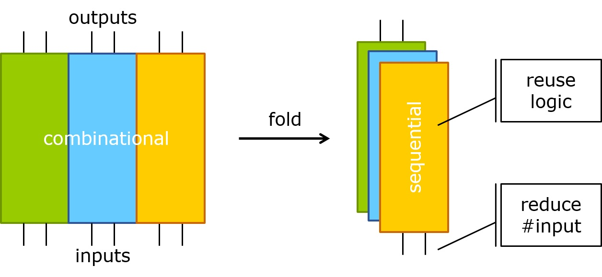

# ext-folding
A circuit folding interface embedded in Berkeley's [ABC](https://github.com/berkeley-abc/abc) system.

## Overview
Circuit folding is a process of transforming a combinational logic circuit _C<sub>c</sub>_ into a sequential circuit _C<sub>s</sub>_, which after time-frame expansion, is functionally equivalent to the original combinational circuit  _C<sub>c</sub>_. It can be done via a functional BDD-based method or a structural AIG-based method. The proposed circuit folding techniques can be useful in testbench generation, sequential synthesis of bounded strategies, time multiplexing in FPGAs, and various applications in logic synthesis.



If you like to learn more about this research work, please refer to these [references](#refs).

## How to Compile
This repository contains an [extension module](https://github.com/berkeley-abc/ext-hello-abc) of [ABC](https://github.com/berkeley-abc/abc). Please follow the instructions below to compile[<sup>[1]</sup>](#fn1) this project.
```
git clone git@github.com:berkeley-abc/abc.git           # clone ABC
git clone git@github.com:Po-Chun-Chien/ext-folding.git  # clone this repository
ln -s ext-folding/ abc/src/.                            # link this repository to abc/src/
cd abc/ && make                                         # build ABC with the extension module
```

Alternately, we also provide the `Dockerfile` to build the docker image capable of executing our codes.
```
git clone git@github.com:Po-Chun-Chien/ext-folding.git  # clone this repository
docker build -t Folding ext-folding/                    # build the docker image
docker run -it Folding                                  # start a container
```

<a class="anchor" id="fn1">[1]</a>: Note that the codes in this project are written in C++11, you may need to set `CXXFLAGS := -std=c++11` in `abc/Makefile`.

## Command Usage
### Circuit Folding Commands
To fold a logic circuit, 3 commands are provided.
* `time_fold` (time-fram folding): It is a reverse operation of time-frame unfolding (expansion). Its input circuit should be in iterative (or time-frame expanded) form.
* `func_fold` (functional BDD-based folding): It is an extension of `time_fold`. Its input is no longer restricted to iterative circuits. Any general combinational circuits would work.
* `stru_fold` (structural AIG-based foldig): It takes the same input as `func_fold`. When compared to `func_fold`, `stru_fold` is more scalable but the resulting folded circuit size is less optimal.

Different from `stru_fold`, which directly generate a folded circuit as a result, commands `time_fold` and `func_fold` produce as their outputs finite state machines (FSM) in [KISS2](https://link.springer.com/content/pdf/bbm%3A978-3-642-36166-1%2F1.pdf) format. You can further apply some minimization techniques (such as [stamina](https://github.com/JackHack96/logic-synthesis) and [MeMin](https://github.com/andreas-abel/MeMin)) to the obtained FSM and encode it into a logic circuit. 

The usage of the 3 commands are listed below.
```
usage: time_fold [-t <num>] [-l <log_file>] [-cvh] <kiss_file>
                     performs time-frame folding on the given iterative (time-frame expanded) circuit and transform it into a FSM in KISS format
        -t         : the number of time-frames to be folded
        -l         : toggles logging of the runtime [default = off]
        -c         : toggles equivalence checking with the original circuit [default = off]
        -v         : toggles verbosity [default = on]
        -h         : prints the command usage
        kiss_file  : (optional) output KISS file name [default = stdout]
```
```
usage: func_fold [-t <num>] [-l <log_file>] [-e <config>] [-cvh] <kiss_file>
                     time multiplexing via functional circuit folding (w/ PO pin sharing)
        -t         : the number of time-frames to be folded
        -l         : toggles logging of the runtime [default = off]
        -e         : toggles experimental configuration (0, 1, 2, 3) [default = 2]
        -c         : toggles equivalence checking with the original circuit [default = off]
        -v         : toggles verbosity [default = on]
        -h         : prints the command usage
        kiss_file  : (optional) output KISS file name [default = stdout
```
```
usage: stru_fold [-t <num>] [-l <log_file>] [-o <out_file>] [-i <split_info> <perm_info>] [-mpcvh]
                     time multiplexing via structural circuit folding (w/ PO pin sharing)
        -t         : the number of time-frames to be folded
        -l         : toggles the logging of runtime [default = off]
        -o         : toggles whether to write the circuit into the specified file [default = off]
        -i         : reads the circuit partitioning and permutation information [default = NULL, NULL]
        -m         : toggles the minimization of flip-flop usage [default = off]
        -p         : toggles the permutation of circuit inputs [default = off]
        -c         : toggles equivalence checking with the original circuit [default = off]
        -v         : toggles verbosity [default = on]
        -h         : prints the command usage
```
### Miscellaneous Commands
Additionally, we implemented some useful helper commands, which are not directly related to circuit folding.
* `memin`: It is a tool for SAT-based exact minimization of incompletely specified Mealy machines. The source code is copied and modified from the original [MeMin repository](https://github.com/andreas-abel/MeMin).
* `kiss_to_blif`: It converts a FSM into a sequential logic circuit with different state encoding methods.

The usage of these commands are listed below.
```
usage: memin [-np] [-nl] [-v {0,1}] [-rh] <input_kiss> <output_kiss>
                        : performs SAT-based exact FSM minimization
        -np             : do not include the 'partial solution' in the SAT problem
        -nl             : like -np, but does also not use the size of the 'partial solution' as a lower bound (i.e., does not need the partial solution at all)
        -v {0,1}        : toggles the verbosity level
        -r              : if no reset state is specified, any state might be a reset state (otherwise, the first state is assumed to be the reset state)
        -h              : prints the command usage
        input_kiss      : the input FSM in KISS format for minimization
        output_kiss     : the output FSM in KISS format after minimization
```

```
usage: kiss_to_blif [-derh] <in.kiss> <out.blif>
                     converts a FSM in KISS format into a sequential circuit in BLIF format
        -d         : the replacing value of don't care outputs [default = 0]
        -e         : the encoding scheme of the states [default = natural]
        -r         : toggles whether to replace current network [default = off]
        -h         : prints the command usage
        in_kiss    : input KISS file
        out_blif   : output BLIF file
```

Check [`example/guide.md`](https://github.com/Po-Chun-Chien/ext-folding/blob/master/example/guide.md) for some simple examples to run our tool.

## <a class="anchor" id="refs"></a>References
Please refer to the following papers if you are interested in our work. You may cite our papers with the provided BibTex entries.

* [ICCAD 2019 paper](https://po-chun-chien.github.io/publication/2019-11-timeFold):
  ```
  @inproceedings{Chien:ICCAD:2019,
      author      = {Po-Chun Chien and Jie-Hong Roland Jiang},
      title       = {Time-Frame Folding: Back to the Sequentiality},
      booktitle   = {Proceedings of the International Conference of Computer-Aided Design (ICCAD)},
      year        = {2019}
  }
  ```

* [DAC 2020 paper](https://po-chun-chien.github.io/publication/2020-07-timeMux):
  ```
  @inproceedings{Chien:DAC:2020,
      author      = {Po-Chun Chien and Jie-Hong Roland Jiang},
      title       = {Time Multiplexing via Circuit Folding},
      booktitle   = {Proceedings of the Design Automation Conference (DAC)},
      year        = {2020}
  }
  ```

* [Master's Thesis](https://po-chun-chien.github.io/publication/2020-06-thesis):
  ```
  @mastersthesis{Chien:Thesis:2020,
      author  = {Po-Chun Chien},
      title   = {Circuit Folding: From Combinational to Sequential Circuits},
      school  = {National Taiwan University},
      year    = {2020}
  }
  ```

## Contact
If you have any problems or suggestions, feel free to create an [issue](https://github.com/Po-Chun-Chien/ext-folding/issues) or contact us through r07943091@ntu.edu.tw.