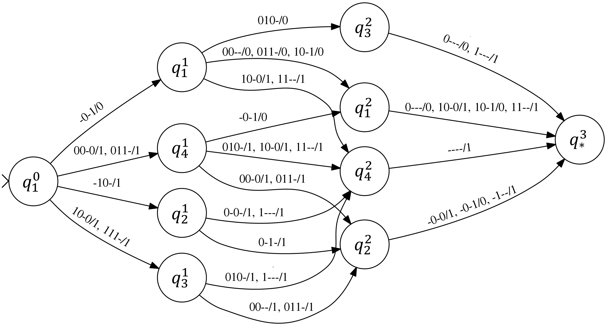
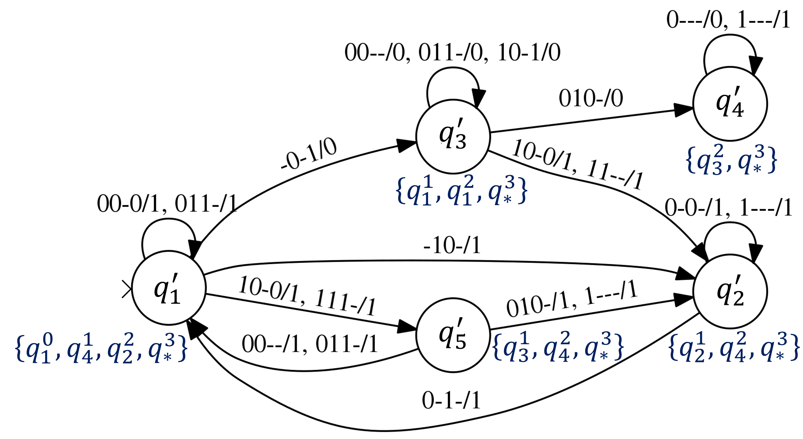
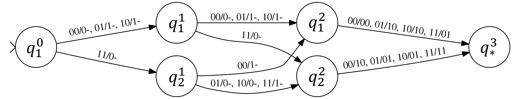
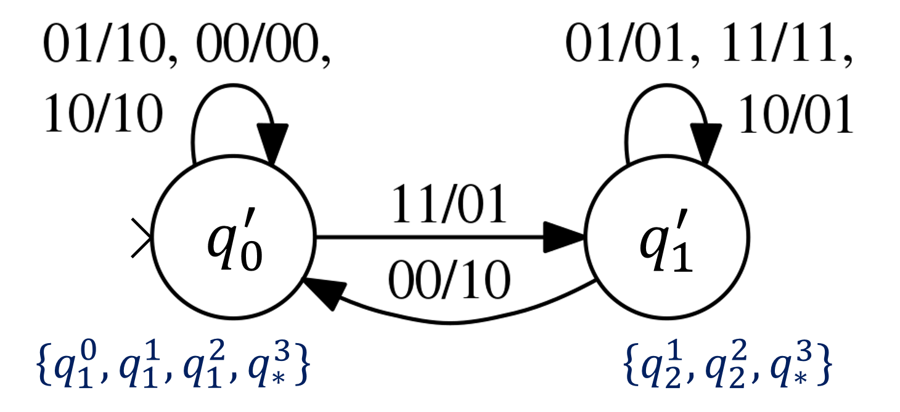

# A Simple Guide to Circuit Folding

## Time-frame Folding
A small sequential circuit `s27` from ISCAS benchmarks is selected as the sample circuit to perform time-frame unfolding and folding. Please enter the following commands in the ABC prompt.
```
UC Berkeley, ABC 1.01 (compiled Oct 13 2019 19:24:34)
abc 01> read src/ext-folding/example/sample_circuits/s27.blif   # read s27 benchmark 
abc 02> frames -i -F 3                                          # time-frame unfolding 
abc 03> time_fold -t 3 -v s27_fsm.kiss                          # time-frame folding
abc 03> memin s27_fsm.kiss s27_fsm.m.kiss                       # FSM minimization
abc 03> kiss_to_blif -r s27_fsm.m.kiss s27_fsm.m.blif           # encode FSM into logic circuit
abc 04> resyn2rs; scorr                                         # logic optimization
abc 07> print_stats                                             # print info.
blif                          : i/o =    4/    1  lat =    3  and =     22  lev =  5
```
You can also run the provided script.
```
./abc -F src/ext-folding/example/scripts/run_time_fold.txt
```
Throughout the process, 3 intermediate files `s27_fsm.kiss`, `s27_fsm.m.kiss` and `s27_fsm.m.blif` are generated. The FSM before and after minimization (`s27_fsm.kiss` and `s27_fsm.m.kiss`) can be visalized as the left and right figures below, respectively.

 

## Functional Circuit Folding
A 3-bit adder is used as the sample circuit to perform functional circuit folding. Please enter the following commands in the ABC prompt.
```
UC Berkeley, ABC 1.01 (compiled Oct 13 2019 19:24:34)
abc 01> read src/ext-folding/example/sample_circuits/03-adder.blif  # read 3-bit adder
abc 02> func_fold -t 3 -v adder_fsm.kiss                            # functional circuit folding
abc 02> memin adder_fsm.kiss adder_fsm.m.kiss                       # FSM minimization
abc 02> kiss_to_blif -r adder_fsm.m.kiss adder_fsm.m.blif           # encode FSM into logic circuit
abc 03> resyn2rs; scorr                                             # logic optimization
abc 06> print_stats                                                 # print info.
blif                          : i/o =    2/    2  lat =    1  and =      8  lev =  4
```
You can also run the provided script.
```
./abc -F src/ext-folding/example/scripts/run_func_fold.txt
```
Similar to time-frame folding, 3 intermediate files are generated during the process. The FSM before and after minimization (`adder_fsm.kiss` and `adder_fsm.m.kiss`) can be visalized as the left and right figures below, respectively. It is interesting to note that the minimized FSM is essentially a carry-save adder, where _q′<sub>0</sub>_ and _q′<sub>1</sub>_ corresponds to the state with carry-bit of value 0 and 1, respectively.

 

## Structural Circuit Folding
The same 3-bit adder is used as the sample circuit to perform structural circuit folding. Please enter the following commands in the ABC prompt.
```
UC Berkeley, ABC 1.01 (compiled Oct 13 2019 19:24:34)
abc 01> read src/ext-folding/example/sample_circuits/03-adder.blif  # read 3-bit adder
abc 02> stru_fold -t 3 -mpv                                         # structural circuit folding
abc 03> resyn2rs; scorr                                             # logic optimization
abc 08> print_stats                                                 # print info.
3-adder_perm-tm3              : i/o =    2/    2  lat =    4  and =     15  lev =  6
```
You can also run the provided script.
```
./abc -F src/ext-folding/example/scripts/run_stru_fold.txt
```
We can see that even though the stuctural method, wich relies on AIG operations, is more scalable than the functional method, which relies on BDD operations, the folded circuit obtained by the structural method is usually less optimal in terms of circuit size (the number of gates, flip-flops...) than the one obtained by the functional method.